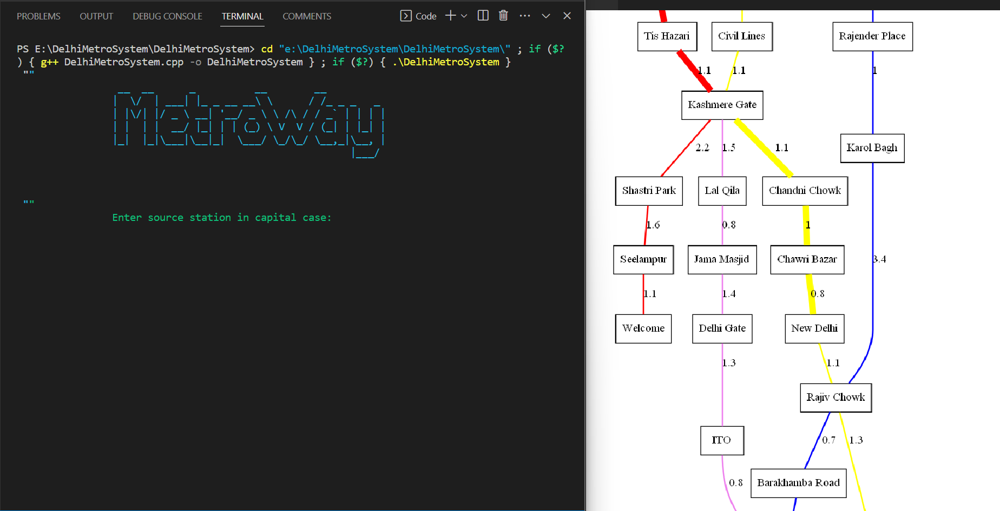
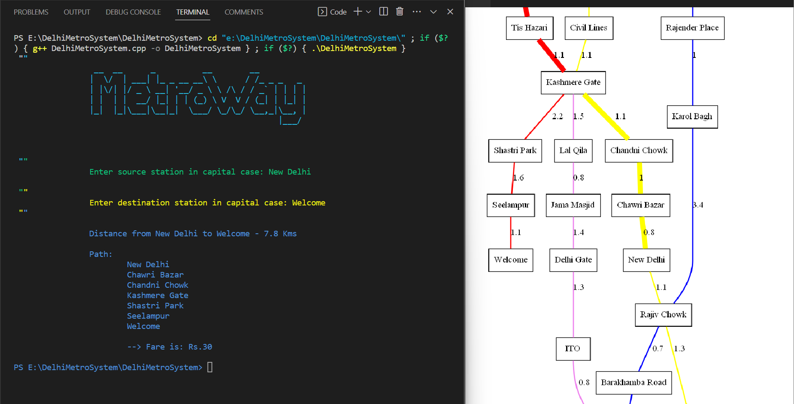
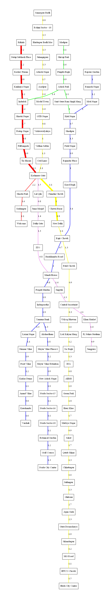

# 🚅 MetroWay - DelhiMetroSystem-CLI-based-project

 

## ⚙️ Tech Stack Used
 - C++ language
 - Graph Data Structute
 - Dijkstra Algorithm (using Set data structure)
 - STL Containers (map, set, vector etc.)
 - C++ File handling (for creating .dot file)
 - Graphviz (for Creating Graph image or pdf using .dot file)
 
 ## 🔰 About
 - MetroWay is an application meant for users, It helps you find & visualize the Shortest Path between Delhi Metro Stations, it uses Graph Data Structure &     Dijkstra's Algorithm.
 
 ## 🌟 Features
 - Find and Show the Shortest Distance between any 2 stations
 - Find and Show the Shortest Route from Source to Destination Station
 - Calculate the Fare using data of DMRC stored in .csv file
 - Also generate a graph png Image using .dot file for visualization
 
 ## 📄 Resources
 - [DMRC](https://www.delhimetrorail.com/)
 
 ## Highlights
 - Start
 
 
 - Run 
 
 
 - Stations shown as Graph using Graphviz
 
 
 ## Credit
 #### - Vikas Kushwaha
 #### - connect with me [LinkedIn](https://linkedin.com/in/vikas-kushwaha-165b95204)
 
 
 
 
